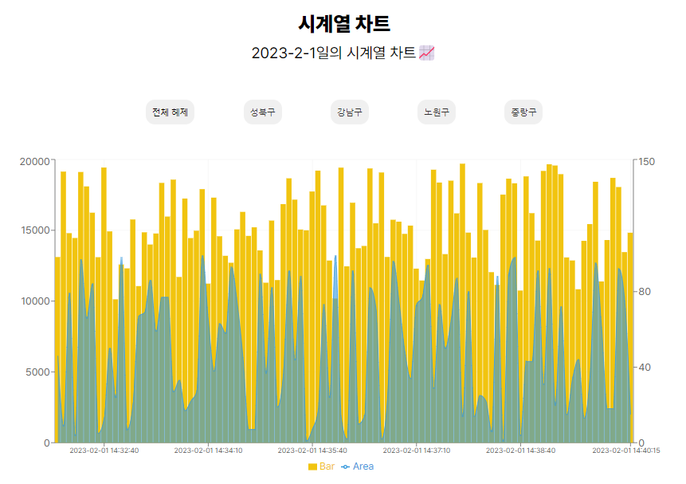
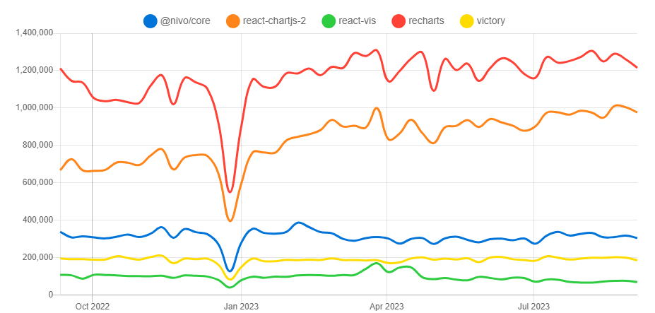

## ⛳목표

주어진 데이터를 기반으로 시계열 차트 만들기



## 🔗배포

https://pre-onboarding-4.vercel.app/

## rechart 라이브러리 선정 이유



- 유명한 라이브러리를 사용하고 싶었습니다. 그 이유는 커뮤니티가 형성되어 개발에 용이할 것이라고 생각했기 때문입니다. npm trends를 확인해보니 rechart와 react-chartjs-2가 압도적이었습니다. 하지만 react-chartjs-2와 비교했을때 두배 넘게 사용량이 많으므로 rechart를 선정했습니다.
- rechart의 document를 살펴보니 제가 사용하고 싶은 차트 유형의 example을 확인 할 수 있어 쉽게 적용할거라 생각하여 해당 라이브러리로 정했습니다.

---

## ✅요구 사항

### 주어진 JSON 데이터의 `key`값(시간)을 기반으로 시계열 차트를 만들어주세요

주어진 json 데이터를 rechart가 요구하는 json 형태에 맞게 parsing

```jsx
const parseData = (rowData: { [key: string]: Chart }) =>
  Object.entries(rowData).reduce(
    (acc: IChart[], [key, value]) => [...acc, { ...value, date: key }],
    []
  );
```

### 특정 데이터 구역에 마우스 호버시 `id, value_area, value_bar` 데이터를 툴팁 형태로 제공해주세요

커스텀 툴팁을 이용하여 호버시 필요한 데이터 표출

```jsx

import { styled } from 'styled-components';
import { TooltipProps } from 'recharts';

const CustomTooltip = ({
  active,
  payload,
}: TooltipProps<number, string>): JSX.Element | null => {
  if (active && payload && payload.length) {
    const [bar, _] = payload;

    return (
      <Wrapper className="custom-tooltip">
        <p className="desc">{bar.payload.id}</p>
        <p className="desc">Area: {bar.payload.value_area}</p>
        <p className="desc">Bar: {bar.payload.value_bar}</p>
      </Wrapper>
    );
  }

  return null;
};

export default CustomTooltip;

```
